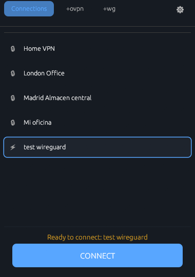
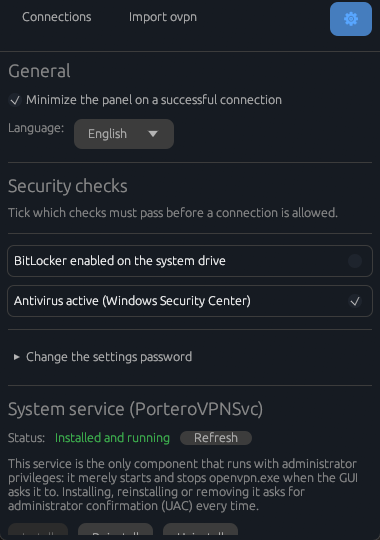

# 🛡️ Portero VPN

### An OpenVPN client that does not let just anyone through

**It checks the computer's security _before_ allowing the connection.** 
If the antivirus is disabled, the tunnel never comes up.

 

 

&nbsp;&nbsp;

Connections · Password-protected settings

  

[Español](README.md) · **English**

 

---

## The problem

A compromised laptop should not be able to reach the corporate network just
because its user happens to hold the `.ovpn` profile and the right credentials.

Portero VPN sits in the middle: **it runs a list of security checks and only
authorises the tunnel if they pass.** If a mandatory check fails, the connection
is never even attempted, and the user is told exactly which one it was.

## Available checks

| | Check | Default |
|:--:| --- | --- |
| 🦠 | Antivirus active (Windows Security Center) | **Enabled and mandatory** |
| 🔒 | BitLocker enabled on the system drive | Disabled |

Each one is toggled separately as **enabled** (it runs and is displayed) and as
**mandatory** (if it fails, it blocks the connection). They are configured from
the Settings screen, password-protected so that the user cannot loosen the
policy themselves.

---

## Installation

> [!NOTE]
> Requires **Windows 10 or later, 64-bit**.

**1.** Download `PorteroVPN-Setup.exe` from
[**Releases**](https://github.com/fmartineze/PorteroVPN/releases).

**2.** Run it. It asks for administrator permission **once**, during
installation.

**3.** The installer copies the application, registers the `PorteroVPNSvc`
service and starts it. Done.

There is no need to install OpenVPN by hand: the application detects whether it
is missing and offers to download and install it from the Connections screen.

---

## Usage

### 🔑 First run

The first time you open the application it asks you to **set the Settings
password** (at least 8 characters).

That password protects the section where it is decided which checks are
mandatory, so it should be known by **whoever administers the computer**, not
necessarily by whoever uses it.

### 📥 Importing a profile

On the **Connections** screen, press **Import ovpn** and pick the file. You will
be asked for:

- A **name** to identify the connection in the list.
- Optionally, a **username and password**, by ticking _"Remember credentials for
  this profile"_.

The application keeps its own copy of the profile; the original file is left
untouched and does not need to be kept.

### 🔌 Connecting

1. Select the connection in the list.
2. Press **CONNECT**.
3. The security checks run. **If a mandatory one fails, the connection stops
   right there** and you will see which it was.
4. If the profile has no stored credentials, they are asked for at that point.

Once the tunnel is up it shows the local IP, the server, the connected time and
the traffic. The button becomes **DISCONNECT**.

Closing the window with the **✕** minimises to the tray icon **without dropping
the connection**. From the icon's menu: **Panel** to bring it back, and **Close**
to actually quit.

### ⚙️ Settings

The gear icon opens the protected section, which asks for the password. From
there you can:

- Enable or disable each check and mark it as mandatory.
- Set how many times a rejected login is **retried** automatically, and how
  long to wait between retries (3 and 3 seconds by default).
- Change the application's **language**.
- Minimise the panel automatically on connect.
- Change the Settings password.
- Install, reinstall or uninstall the `PorteroVPNSvc` service.

---

## Where the data is stored

Everything lives under `C:\ProgramData\PorteroVPN\`: the imported profiles and
their metadata, the check policy, the preferences, and the logs of the
application and of every connection attempt (`logs\`, the last 10 are kept).
**It is the first place to look when something goes wrong.**

---

## License

Portero VPN is distributed under the **Apache License 2.0** — see
[`LICENSE`](LICENSE) and [`NOTICE`](NOTICE).

`openvpn.exe` is under GPLv2, but it is **neither linked nor redistributed**: it
runs as a separate process and is driven through its command line and its
management interface. That separation is deliberate, and it is the basis for the
GPLv2 obligations not reaching this code; it must not be reverted without
reviewing the implications first.

The full detail, along with the license breakdown of the 391 dependencies (all
permissive), is in [`THIRD_PARTY_NOTICES.md`](THIRD_PARTY_NOTICES.md).
