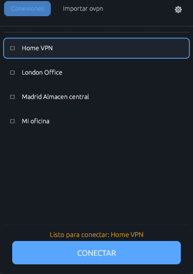
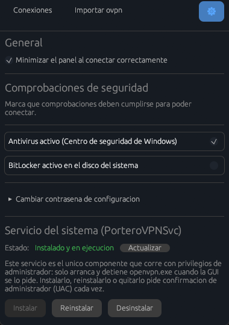

<div align="center">

# 🛡️ Portero VPN

### Un cliente OpenVPN que no deja pasar a cualquiera

**Comprueba la seguridad del equipo _antes_ de permitir la conexión.**<br>
Si el antivirus está desactivado, el túnel no se levanta.

<br>

[](LICENSE)
[](#instalación)
[](#desarrollo)
[](https://github.com/fmartineze/PorteroVPN/releases)

<br>


&nbsp;&nbsp;


<sub>Conexiones · Configuración protegida por contraseña</sub>

</div>

<br>

---

## El problema

Un portátil comprometido no debería poder entrar en la red corporativa solo
porque su usuario tenga el perfil `.ovpn` y las credenciales correctas.

Portero VPN se pone en medio: **ejecuta una lista de comprobaciones de seguridad
y solo si se cumplen autoriza el arranque del túnel.** Si alguna comprobación
obligatoria falla, la conexión ni siquiera se intenta y el usuario ve
exactamente cuál ha sido.

## Comprobaciones disponibles

| | Comprobación | Por defecto |
|:--:| --- | --- |
| 🦠 | Antivirus activo (Centro de seguridad de Windows) | **Activada y obligatoria** |
| 🔒 | BitLocker activo en el disco del sistema | Desactivada |

Cada una se marca por separado como **activa** (se ejecuta y se muestra) y como
**obligatoria** (si falla, bloquea la conexión). Se configuran desde la pantalla
de Configuración, protegida por contraseña para que el propio usuario no pueda
relajar la política.

---

## Instalación

> [!NOTE]
> Requiere **Windows 10 o superior, 64 bits**.

**1.** Descarga `PorteroVPN-Setup.exe` desde
[**Releases**](https://github.com/fmartineze/PorteroVPN/releases).
Si todavía no hay ninguna publicada, compílalo tú mismo: ver
[Desarrollo](#desarrollo).

**2.** Ejecútalo. Pedirá permisos de administrador **una sola vez**, durante la
instalación.

**3.** El instalador copia la aplicación, registra el servicio `PorteroVPNSvc` y
lo arranca. Listo.

No hace falta instalar OpenVPN a mano: la propia aplicación detecta si falta y
ofrece descargarlo e instalarlo desde la pantalla de Conexiones.

---

## Uso

### 🔑 Primer arranque

Al abrir la aplicación por primera vez te pedirá **definir la contraseña de
Configuración** (mínimo 8 caracteres).

Esa contraseña protege la sección donde se decide qué comprobaciones son
obligatorias, así que debe conocerla **quien administra el equipo**, no
necesariamente quien lo usa.

### 📥 Importar un perfil

En la pantalla **Conexiones**, pulsa **Importar ovpn** y elige el archivo. Se te
pedirá:

- Un **nombre** para identificar la conexión en la lista.
- Opcionalmente, **usuario y contraseña**, marcando _"Recordar credenciales para
  este perfil"_.

La aplicación guarda una copia propia del perfil; el archivo original no se toca
ni hace falta conservarlo.

### 🔌 Conectar

1. Selecciona la conexión en la lista.
2. Pulsa **CONECTAR**.
3. Se ejecutan las comprobaciones de seguridad. **Si alguna obligatoria falla,
   la conexión se detiene ahí** y verás cuál ha sido.
4. Si el perfil no tiene credenciales guardadas, se piden en ese momento.

Con el túnel levantado se muestran la IP local, el servidor, el tiempo conectado
y el tráfico. El botón pasa a **DESCONECTAR**.

Cerrar la ventana con la **✕** minimiza al icono de bandeja **sin cortar la
conexión**. Desde el menú del icono: **Panel** para volver a abrirla y **Cerrar**
para salir de verdad.

### ⚙️ Configuración

El icono del engranaje abre la sección protegida, que pide la contraseña. Desde
ahí se puede:

- Activar o desactivar cada comprobación y marcarla como obligatoria.
- Minimizar el panel automáticamente al conectar.
- Cambiar la contraseña de Configuración.
- Instalar, reinstalar o desinstalar el servicio `PorteroVPNSvc`.

---

## Cómo funciona por dentro

Tres componentes, con **separación de privilegios** como decisión central:

| Componente | Privilegios | Responsabilidad |
| --- | --- | --- |
| `portero-vpn` | 👤 Usuario normal | Interfaz, comprobaciones, credenciales y control de la conexión |
| `portero-vpn-svc` | 🔧 LocalSystem | Solo lanza y mata `openvpn.exe` |
| `svc-ipc` | — | Tipos de mensaje compartidos entre ambos |

La interfaz **nunca corre elevada**. El servicio del sistema es deliberadamente
mínimo: no interpreta perfiles `.ovpn`, no ve credenciales y no decide política
de seguridad. Recibe por un named pipe la ruta y el puerto que la interfaz ya ha
elegido, y ejecuta el proceso. La única excepción es la consulta de BitLocker,
que vive ahí porque su namespace WMI está restringido a Administradores.

Una vez arrancado OpenVPN, la interfaz habla directamente con su _management
interface_ por un socket TCP local, autenticándose con un fichero de contraseña
de un solo uso, para que ningún otro proceso de la máquina pueda tomar el
control del túnel.

### Seguridad de las credenciales

- **Credenciales VPN** — cifradas con DPAPI ligado al usuario de Windows, con
  entropía adicional propia de la aplicación. Nunca se guardan en claro, y
  guardarlas es opcional por perfil.
- **Contraseña de Configuración** — hash Argon2id con sal por contraseña.

### Dónde se guardan los datos

Todo vive en `C:\ProgramData\PorteroVPN\`: los perfiles importados y sus
metadatos, la política de comprobaciones, las preferencias, y los registros de
la aplicación y de cada intento de conexión (`logs\`, se conservan los 10
últimos). **Es el primer sitio donde mirar si algo falla.**

---

## Desarrollo

Necesitas Rust estable con el toolchain MSVC (probado con 1.96.0) y, para
empaquetar, [Inno Setup 6](https://jrsoftware.org/isdl.php).

```powershell
cargo build --release --workspace
cargo test --workspace
```

> [!IMPORTANT]
> **`cargo build --release` a secas NO sirve.** El paquete raíz es el único
> `default-member` del workspace, así que sin `--workspace` no se genera
> `portero-vpn-svc.exe` y el instalador fallará al no encontrarlo.

Algunos tests están marcados `#[ignore]` porque dependen de red real, del
antivirus de la máquina o de que `PorteroVPNSvc` esté corriendo. Para
ejecutarlos: `cargo test -- --ignored`.

Para generar el instalador, desde `installer\`:

```powershell
& "$env:LOCALAPPDATA\Programs\Inno Setup 6\ISCC.exe" portero-vpn.iss
```

El resultado queda en `installer\output\PorteroVPN-Setup.exe`.

**Añadir una comprobación nueva** consiste en implementar el trait `Check` y
registrarla en `CheckRegistry::new()`; aparece sola en la pantalla de
Configuración.

Los comentarios del código documentan el incidente real que motivó cada
constante y cada espera aparentemente arbitraria. Merece la pena leerlos antes
de "simplificar" algo que parezca de más.

---

## Limitaciones conocidas

- Una sola conexión activa a la vez.
- El volumen de arranque se asume `C:` en la consulta de BitLocker.
- En **Windows Home**, donde BitLocker no existe, la comprobación se resuelve
  como fallo. Si se marca como obligatoria en un equipo Home, bloquea la
  conexión sin salida posible para el usuario. Viene desactivada por defecto.
- `vendor/egui-wgpu-0.29.1` es una copia local parcheada de egui-wgpu 0.29.1
  (reintenta con `force_fallback_adapter: true`). Al subir de versión de
  eframe/egui hay que revisar si el parche sigue haciendo falta.
- `assets/lavapipe/vulkan_lvp.dll` (54 MB) está versionado a propósito: es el
  driver Vulkan por software que se usa como último recurso en equipos sin
  ningún backend gráfico utilizable (visto en una VM Win11 sobre Proxmox).

---

## Licencia

Portero VPN se distribuye bajo la **Licencia Apache 2.0** — ver [`LICENSE`](LICENSE)
y [`NOTICE`](NOTICE).

`openvpn.exe` está bajo GPLv2, pero **no se enlaza ni se redistribuye**: se
ejecuta como proceso independiente y se habla con él por línea de comandos y por
su management interface. Esa separación es deliberada y es la base para que las
obligaciones de la GPLv2 no alcancen a este código; no debe revertirse sin
revisar antes sus implicaciones.

El detalle completo, junto con el reparto de licencias de las 391 dependencias
(todas permisivas), está en
[`THIRD_PARTY_NOTICES.md`](THIRD_PARTY_NOTICES.md).
